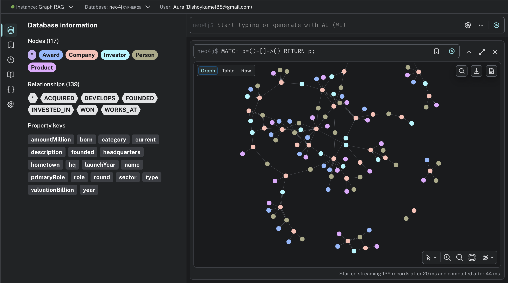

# Tech / Startups Knowledge Graph — Neo4j Cypher Load Script

## 1. Ontology

**Node labels**

| Label | Key property | Other properties |
|---|---|---|
| `Person` | `name` | `born`, `hometown` |
| `Company` | `name` | `founded`, `sector`, `headquarters`, `valuationBillion`, `description` |
| `Investor` | `name` | `founded`, `type`, `hq` |
| `Product` | `name` | `category`, `launchYear` |
| `Award` | `name` | `category`, `year` |

**Relationship types**

| Relationship | Pattern | Properties |
|---|---|---|
| `FOUNDED` | `(:Person)-[:FOUNDED]->(:Company)` | `year` |
| `WORKS_AT` | `(:Person)-[:WORKS_AT]->(:Company)` | `role`, `current` (boolean) |
| `INVESTED_IN` | `(:Investor)-[:INVESTED_IN]->(:Company)` | `round`, `amountMillion`, `year` |
| `ACQUIRED` | `(:Company)-[:ACQUIRED]->(:Company)` | `year`, `amountMillion` |
| `DEVELOPS` | `(:Company)-[:DEVELOPS]->(:Product)` | — |
| `WON` | `(:Person\|:Company)-[:WON]->(:Award)` | — |

`Person` is used for both founders and non-founder executives — the sheet's
`role` column is kept as a person-level "primary role" attribute, while the
actual role at each company (which can differ, and can change over time) lives
on the `WORKS_AT` relationship instead.

## 2. Data quality issues found and how they were handled

- **Exact duplicate rows**: `Elena Rossi` (Founders), `GreenGrid` (Companies),
  `Marcus Chen → DataForge, 2014` (Founded), and `NovaPay → NovaPay Wallet` /
  `DataForge → ForgeML` (Develops) were each listed twice — de-duplicated.
- **Near-duplicate / conflicting row**: `WorksAt` contains both
  `Elena Rossi | NovaPay | CEO | TRUE` and `elena rossi | novapay | Founder | TRUE`
  (case difference + conflicting role for the same person/company pair). Kept
  the properly-cased `CEO` row and dropped the lowercase duplicate.
- **Inconsistent capitalization**: `founder` vs `Founder`, `ai` vs `AI` (sector)
  — normalized to consistent casing.
- **Inconsistent boolean formats**: `current` used `yes` / `Y` / `TRUE` —
  normalized to a real boolean.
- **Missing values**: `Omar Haddad` has no hometown; `EduSpark` has no
  valuation; `ForgeServe` has no launch year; `Pioneer Labs Fund` has no
  founding year — all loaded as `null` rather than guessed.
- **Stray whitespace**: leading space before `Summit Ventures` in the first
  `InvestedIn` row — trimmed.
- **Mixed numeric formats**: `founded`/`valuation_billion` mixed floats/ints
  (e.g. `2016.0` vs `2016`) — normalized to plain numbers.
- **Dangling references** (rows pointing at entities that don't exist in the
  node sheets): `Phantom Capital` (an investor in `InvestedIn`, absent from the
  `Investors` sheet) and `GhostApp` (an award winner in `Won`, absent from the
  `Companies` sheet). The script below uses `MERGE` for relationship
  endpoints, so these will still load without erroring, but they're flagged
  here since they likely represent bad source data worth following up on —
  consider tagging them, e.g. `SET x:Unverified`, or excluding them.

## 3. Cypher script

Run top to bottom in Neo4j Browser / Cypher Shell / Neo4j Desktop.

```cypher
// ============================================================
// 0. CONSTRAINTS (uniqueness + faster MERGE lookups)
// ============================================================
CREATE CONSTRAINT person_name IF NOT EXISTS FOR (p:Person) REQUIRE p.name IS UNIQUE;
CREATE CONSTRAINT company_name IF NOT EXISTS FOR (c:Company) REQUIRE c.name IS UNIQUE;
CREATE CONSTRAINT investor_name IF NOT EXISTS FOR (i:Investor) REQUIRE i.name IS UNIQUE;
CREATE CONSTRAINT product_name IF NOT EXISTS FOR (pr:Product) REQUIRE pr.name IS UNIQUE;
CREATE CONSTRAINT award_name IF NOT EXISTS FOR (a:Award) REQUIRE a.name IS UNIQUE;

// ============================================================
// 1. NODES — Person  (Founders sheet, deduplicated)
// ============================================================
UNWIND [
  {name:"Elena Rossi", born:1985, role:"Founder", hometown:"Milan"},
  {name:"Marcus Chen", born:1979, role:"Founder", hometown:"San Francisco"},
  {name:"Priya Nair", born:1988, role:"Founder", hometown:"Bangalore"},
  {name:"David Okafor", born:1982, role:"Founder", hometown:"Lagos"},
  {name:"Sofia Lindqvist", born:1990, role:"Founder", hometown:"Stockholm"},
  {name:"James Whitfield", born:1975, role:"Founder", hometown:"Austin"},
  {name:"Yuki Tanaka", born:1986, role:"Founder", hometown:"Tokyo"},
  {name:"Aisha Rahman", born:1991, role:"Founder", hometown:"Dubai"},
  {name:"Tomas Herrera", born:1983, role:"Founder", hometown:"Mexico City"},
  {name:"Nadia Volkov", born:1987, role:"Founder", hometown:"Berlin"},
  {name:"Liam O'Brien", born:1980, role:"Founder", hometown:"Dublin"},
  {name:"Grace Kim", born:1989, role:"Founder", hometown:"Seoul"},
  {name:"Omar Haddad", born:1984, role:"Founder", hometown:null},
  {name:"Isabella Ferreira", born:1992, role:"Founder", hometown:"Sao Paulo"},
  {name:"Ethan Brooks", born:1977, role:"Founder", hometown:"Boston"},
  {name:"Mei Ling", born:1985, role:"Founder", hometown:"Shanghai"},
  {name:"Rafael Santos", born:1981, role:"Founder", hometown:"Lisbon"},
  {name:"Hannah Schmidt", born:1990, role:"Founder", hometown:"Munich"},
  {name:"Arjun Mehta", born:1986, role:"Founder", hometown:"Mumbai"},
  {name:"Chloe Dubois", born:1988, role:"Founder", hometown:"Paris"},
  {name:"Robert Nguyen", born:1972, role:"CEO", hometown:"San Jose"},
  {name:"Linda Park", born:1976, role:"CEO", hometown:"Los Angeles"},
  {name:"Samuel Adeyemi", born:1979, role:"CTO", hometown:"Nairobi"},
  {name:"Fatima Al-Sayed", born:1983, role:"CTO", hometown:"Riyadh"},
  {name:"Victor Petrov", born:1974, role:"COO", hometown:"Prague"},
  {name:"Emma Larsson", born:1987, role:"CPO", hometown:"Oslo"},
  {name:"Daniel Cohen", born:1981, role:"CFO", hometown:"Tel Aviv"},
  {name:"Ananya Iyer", born:1990, role:"CTO", hometown:"Hyderabad"},
  {name:"Michael Torres", born:1978, role:"CEO", hometown:"Miami"},
  {name:"Sarah Bennett", born:1985, role:"CMO", hometown:"London"}
] AS row
MERGE (p:Person {name: row.name})
SET p.born = row.born, p.primaryRole = row.role, p.hometown = row.hometown;

// ============================================================
// 2. NODES — Company  (Companies sheet, deduplicated + cleaned)
// ============================================================
UNWIND [
  {name:"NovaPay", founded:2016, sector:"Fintech", hq:"San Francisco", valuation:12.5, description:"A digital payments platform enabling instant cross-border transfers for small businesses."},
  {name:"HealthLoop", founded:2015, sector:"HealthTech", hq:"Boston", valuation:6.2, description:"An AI-driven platform that connects patients with clinicians and monitors chronic conditions remotely."},
  {name:"GreenGrid", founded:2017, sector:"CleanTech", hq:"Stockholm", valuation:4.8, description:"A smart-grid company optimizing renewable energy distribution across cities."},
  {name:"DataForge", founded:2014, sector:"AI", hq:"San Francisco", valuation:18, description:"A machine learning infrastructure company providing model training and deployment tools."},
  {name:"ShopSphere", founded:2013, sector:"E-commerce", hq:"Austin", valuation:9.4, description:"A headless commerce platform powering online stores for mid-market retailers."},
  {name:"CloudNest", founded:2012, sector:"Cloud", hq:"San Jose", valuation:22.3, description:"A cloud hosting provider specializing in serverless computing for developers."},
  {name:"EduSpark", founded:2018, sector:"EdTech", hq:"Bangalore", valuation:null, description:"An adaptive learning platform delivering personalized STEM courses to students worldwide."},
  {name:"AgriSense", founded:2016, sector:"AgriTech", hq:"Sao Paulo", valuation:2.4, description:"IoT sensors and analytics that help farmers improve crop yields and reduce water use."},
  {name:"SecureLayer", founded:2015, sector:"Cybersecurity", hq:"Tel Aviv", valuation:7.9, description:"A zero-trust security platform protecting enterprises from network intrusions."},
  {name:"MobiliT", founded:2017, sector:"Mobility", hq:"Berlin", valuation:5.6, description:"An electric scooter and micro-mobility sharing network across European cities."},
  {name:"FoodChain", founded:2019, sector:"FoodTech", hq:"Lagos", valuation:1.2, description:"A supply chain platform connecting farmers directly with urban restaurants and grocers."},
  {name:"QuantumLeap", founded:2018, sector:"DeepTech", hq:"Munich", valuation:3.8, description:"A quantum computing startup building error-corrected qubits for optimization problems."},
  {name:"StreamWave", founded:2014, sector:"Media", hq:"Los Angeles", valuation:8.7, description:"A video streaming infrastructure company powering live events at global scale."},
  {name:"BioNova", founded:2016, sector:"BioTech", hq:"Cambridge", valuation:6.9, description:"A biotech firm developing mRNA-based therapies for rare genetic diseases."},
  {name:"PropertyPro", founded:2013, sector:"PropTech", hq:"London", valuation:4.2, description:"A real estate marketplace using AI to match buyers with properties and predict prices."},
  {name:"LogiFlow", founded:2015, sector:"Logistics", hq:"Singapore", valuation:5.1, description:"A logistics optimization platform routing freight across Southeast Asian ports."},
  {name:"PayCircle", founded:2019, sector:"Fintech", hq:"Dubai", valuation:2, description:"A neobank for gig-economy workers offering instant payouts and micro-loans."},
  {name:"VirtualForge", founded:2017, sector:"AR/VR", hq:"Seoul", valuation:3.3, description:"An augmented reality platform for industrial training and remote maintenance."},
  {name:"CarbonZero", founded:2018, sector:"CleanTech", hq:"Copenhagen", valuation:2.7, description:"A carbon accounting platform helping enterprises measure and offset emissions."},
  {name:"MediChain", founded:2016, sector:"HealthTech", hq:"Toronto", valuation:3.9, description:"A blockchain-based health records system giving patients control over their data."},
  {name:"RetailIQ", founded:2014, sector:"Retail", hq:"Paris", valuation:4.6, description:"A retail analytics platform predicting demand and optimizing store inventory."},
  {name:"SkyRoute", founded:2015, sector:"Aerospace", hq:"Seattle", valuation:6.4, description:"A drone delivery network operating in rural and hard-to-reach regions."},
  {name:"TalentHub", founded:2017, sector:"HRTech", hq:"Dublin", valuation:2.9, description:"A recruitment platform using AI to match candidates with roles and reduce bias."},
  {name:"GameForge", founded:2013, sector:"Gaming", hq:"Tokyo", valuation:7.2, description:"A cloud gaming studio publishing cross-platform multiplayer titles."},
  {name:"InsureWise", founded:2016, sector:"InsurTech", hq:"Zurich", valuation:3.5, description:"An insurance platform offering usage-based policies powered by real-time data."},
  {name:"VoiceCraft", founded:2019, sector:"AI", hq:"San Francisco", valuation:4, description:"A conversational AI company building natural-sounding voice assistants for enterprises."},
  {name:"UrbanFarm", founded:2018, sector:"AgriTech", hq:"Amsterdam", valuation:1.8, description:"A vertical farming company growing produce inside city warehouses year-round."},
  {name:"FinLedger", founded:2012, sector:"Fintech", hq:"New York City", valuation:14.1, description:"An accounting automation platform for small and medium businesses."}
] AS row
MERGE (c:Company {name: row.name})
SET c.founded = row.founded, c.sector = row.sector, c.headquarters = row.hq,
    c.valuationBillion = row.valuation, c.description = row.description;

// ============================================================
// 3. NODES — Investor  (Investors sheet)
// ============================================================
UNWIND [
  {name:"Summit Ventures", founded:1998, type:"Venture Capital", hq:"Menlo Park"},
  {name:"Northstar Capital", founded:2005, type:"Venture Capital", hq:"New York City"},
  {name:"Blue Harbor Partners", founded:2001, type:"Private Equity", hq:"Boston"},
  {name:"Orbit Fund", founded:2010, type:"Venture Capital", hq:"London"},
  {name:"Sequoia Trail", founded:1995, type:"Venture Capital", hq:"Menlo Park"},
  {name:"Dragonfly Capital", founded:2012, type:"Venture Capital", hq:"Singapore"},
  {name:"Meridian Growth", founded:2008, type:"Growth Equity", hq:"San Francisco"},
  {name:"Cedar Angel Group", founded:2014, type:"Angel Network", hq:"Austin"},
  {name:"Pioneer Labs Fund", founded:null, type:"Accelerator", hq:"Berlin"},
  {name:"Atlas Ventures", founded:2003, type:"Venture Capital", hq:"Tel Aviv"},
  {name:"Horizon Equity", founded:2007, type:"Private Equity", hq:"Zurich"},
  {name:"Nexus Seed", founded:2015, type:"Seed Fund", hq:"Bangalore"},
  {name:"Everest Partners", founded:2000, type:"Venture Capital", hq:"Palo Alto"},
  {name:"Lighthouse Capital", founded:2011, type:"Venture Capital", hq:"Toronto"},
  {name:"Vanguard Tech Fund", founded:2006, type:"Growth Equity", hq:"Tokyo"}
] AS row
MERGE (i:Investor {name: row.name})
SET i.founded = row.founded, i.type = row.type, i.hq = row.hq;

// ============================================================
// 4. NODES — Product  (Products sheet)
// ============================================================
UNWIND [
  {name:"NovaPay Wallet", category:"Mobile App", launchYear:2016},
  {name:"NovaPay Business", category:"SaaS", launchYear:2018},
  {name:"LoopCare", category:"Mobile App", launchYear:2016},
  {name:"GridOptimizer", category:"Platform", launchYear:2018},
  {name:"ForgeML", category:"Developer Tool", launchYear:2015},
  {name:"ForgeServe", category:"Developer Tool", launchYear:null},
  {name:"SphereStore", category:"SaaS", launchYear:2014},
  {name:"NestServerless", category:"Cloud Service", launchYear:2013},
  {name:"SparkLearn", category:"Mobile App", launchYear:2018},
  {name:"SenseField", category:"IoT Device", launchYear:2017},
  {name:"ShieldNet", category:"Security Suite", launchYear:2016},
  {name:"MobiliT Go", category:"Mobile App", launchYear:2017},
  {name:"FoodChain Connect", category:"Platform", launchYear:2019},
  {name:"QubitOne", category:"Hardware", launchYear:2020},
  {name:"WaveCast", category:"Cloud Service", launchYear:2015},
  {name:"NovaTherapy", category:"Biotech Product", launchYear:2019},
  {name:"PropMatch", category:"Platform", launchYear:2014},
  {name:"FlowRoute", category:"SaaS", launchYear:2016},
  {name:"VoiceCraft Studio", category:"Developer Tool", launchYear:2019},
  {name:"HarvestTower", category:"Hardware", launchYear:2019},
  {name:"LedgerBooks", category:"SaaS", launchYear:2013},
  {name:"SkyDrop", category:"Platform", launchYear:2016}
] AS row
MERGE (pr:Product {name: row.name})
SET pr.category = row.category, pr.launchYear = row.launchYear;

// ============================================================
// 5. NODES — Award  (Awards sheet)
// ============================================================
UNWIND [
  {name:"TechCrunch Startup of the Year 2019", category:"Industry", year:2019},
  {name:"TechCrunch Startup of the Year 2021", category:"Industry", year:2021},
  {name:"Forbes Cloud 100 2020", category:"Industry", year:2020},
  {name:"Forbes Cloud 100 2022", category:"Industry", year:2022},
  {name:"CES Innovation Award 2018", category:"Product", year:2018},
  {name:"CES Innovation Award 2020", category:"Product", year:2020},
  {name:"Fast Company Most Innovative 2019", category:"Industry", year:2019},
  {name:"Fast Company Most Innovative 2021", category:"Industry", year:2021},
  {name:"Webby Award Best Fintech App 2018", category:"Product", year:2018},
  {name:"Webby Award Best HealthTech App 2020", category:"Product", year:2020},
  {name:"EU Sustainability Prize 2019", category:"Impact", year:2019},
  {name:"EU Sustainability Prize 2021", category:"Impact", year:2021},
  {name:"Founder of the Year 2020", category:"Individual", year:2020},
  {name:"Founder of the Year 2022", category:"Individual", year:2022},
  {name:"Women in Tech Leadership Award 2019", category:"Individual", year:2019},
  {name:"Women in Tech Leadership Award 2021", category:"Individual", year:2021},
  {name:"Deloitte Fast 500 2020", category:"Industry", year:2020},
  {name:"Deloitte Fast 500 2022", category:"Industry", year:2022},
  {name:"MIT TR35 Innovator 2018", category:"Individual", year:2018},
  {name:"MIT TR35 Innovator 2020", category:"Individual", year:2020}
] AS row
MERGE (a:Award {name: row.name})
SET a.category = row.category, a.year = row.year;

// ============================================================
// 6. RELATIONSHIP — FOUNDED  (Person)-[:FOUNDED]->(Company)
// ============================================================
UNWIND [
  {p:"Elena Rossi", c:"NovaPay", year:2016},
  {p:"Marcus Chen", c:"DataForge", year:2014},
  {p:"Marcus Chen", c:"VoiceCraft", year:2019},
  {p:"Priya Nair", c:"EduSpark", year:2018},
  {p:"David Okafor", c:"FoodChain", year:2019},
  {p:"Sofia Lindqvist", c:"GreenGrid", year:2017},
  {p:"James Whitfield", c:"ShopSphere", year:2013},
  {p:"Yuki Tanaka", c:"GameForge", year:2013},
  {p:"Aisha Rahman", c:"PayCircle", year:2019},
  {p:"Tomas Herrera", c:"AgriSense", year:2016},
  {p:"Nadia Volkov", c:"MobiliT", year:2017},
  {p:"Liam O'Brien", c:"TalentHub", year:2017},
  {p:"Grace Kim", c:"VirtualForge", year:2017},
  {p:"Omar Haddad", c:"SecureLayer", year:2015},
  {p:"Isabella Ferreira", c:"AgriSense", year:2016},
  {p:"Ethan Brooks", c:"CloudNest", year:2012},
  {p:"Ethan Brooks", c:"FinLedger", year:2012},
  {p:"Mei Ling", c:"RetailIQ", year:2014},
  {p:"Rafael Santos", c:"PropertyPro", year:2013},
  {p:"Hannah Schmidt", c:"QuantumLeap", year:2018},
  {p:"Arjun Mehta", c:"HealthLoop", year:2015},
  {p:"Chloe Dubois", c:"CarbonZero", year:2018},
  {p:"Sofia Lindqvist", c:"CarbonZero", year:2018},
  {p:"Michael Torres", c:"StreamWave", year:2014},
  {p:"Aisha Rahman", c:"InsureWise", year:2016},
  {p:"David Okafor", c:"SkyRoute", year:2015},
  {p:"Grace Kim", c:"MediChain", year:2016},
  {p:"Priya Nair", c:"UrbanFarm", year:2018},
  {p:"Rafael Santos", c:"LogiFlow", year:2015},
  {p:"Omar Haddad", c:"BioNova", year:2016}
] AS row
MATCH (p:Person {name: row.p})
MATCH (c:Company {name: row.c})
MERGE (p)-[r:FOUNDED]->(c)
SET r.year = row.year;

// ============================================================
// 7. RELATIONSHIP — WORKS_AT  (Person)-[:WORKS_AT]->(Company)
// ============================================================
UNWIND [
  {p:"Robert Nguyen", c:"CloudNest", role:"CEO", current:true},
  {p:"Linda Park", c:"StreamWave", role:"CEO", current:true},
  {p:"Samuel Adeyemi", c:"FoodChain", role:"CTO", current:true},
  {p:"Fatima Al-Sayed", c:"SecureLayer", role:"CTO", current:true},
  {p:"Victor Petrov", c:"QuantumLeap", role:"COO", current:true},
  {p:"Emma Larsson", c:"GreenGrid", role:"CPO", current:true},
  {p:"Daniel Cohen", c:"SecureLayer", role:"CFO", current:true},
  {p:"Ananya Iyer", c:"HealthLoop", role:"CTO", current:true},
  {p:"Michael Torres", c:"StreamWave", role:"CEO", current:true},
  {p:"Sarah Bennett", c:"PropertyPro", role:"CMO", current:true},
  {p:"Elena Rossi", c:"NovaPay", role:"CEO", current:true},
  {p:"Marcus Chen", c:"DataForge", role:"Executive Chairman", current:true},
  {p:"Marcus Chen", c:"VoiceCraft", role:"CEO", current:true},
  {p:"Priya Nair", c:"EduSpark", role:"CEO", current:true},
  {p:"Grace Kim", c:"VirtualForge", role:"CEO", current:true},
  {p:"Grace Kim", c:"MediChain", role:"Board Member", current:false},
  {p:"Ethan Brooks", c:"CloudNest", role:"Board Member", current:false},
  {p:"Ethan Brooks", c:"FinLedger", role:"CEO", current:true},
  {p:"Robert Nguyen", c:"DataForge", role:"Advisor", current:false},
  {p:"Ananya Iyer", c:"DataForge", role:"Engineer", current:false},
  {p:"Sofia Lindqvist", c:"GreenGrid", role:"CEO", current:true},
  {p:"Yuki Tanaka", c:"GameForge", role:"CEO", current:true},
  {p:"Fatima Al-Sayed", c:"DataForge", role:"Engineer", current:false},
  {p:"Sarah Bennett", c:"NovaPay", role:"Marketing Lead", current:false},
  {p:"Daniel Cohen", c:"NovaPay", role:"Advisor", current:false}
] AS row
MATCH (p:Person {name: row.p})
MATCH (c:Company {name: row.c})
MERGE (p)-[r:WORKS_AT {role: row.role}]->(c)
SET r.current = row.current;

// ============================================================
// 8. RELATIONSHIP — INVESTED_IN  (Investor)-[:INVESTED_IN]->(Company)
//    Note: "Phantom Capital" is not in the Investors sheet (dangling ref);
//    MERGE below will create a bare Investor node for it.
// ============================================================
UNWIND [
  {i:"Summit Ventures", c:"NovaPay", round:"Series A", amount:15, year:2017},
  {i:"Summit Ventures", c:"NovaPay", round:"Series B", amount:45, year:2019},
  {i:"Northstar Capital", c:"NovaPay", round:"Series C", amount:120, year:2021},
  {i:"Sequoia Trail", c:"DataForge", round:"Series A", amount:20, year:2015},
  {i:"Sequoia Trail", c:"DataForge", round:"Series B", amount:80, year:2017},
  {i:"Meridian Growth", c:"DataForge", round:"Series C", amount:200, year:2020},
  {i:"Orbit Fund", c:"GreenGrid", round:"Seed", amount:3, year:2017},
  {i:"Orbit Fund", c:"GreenGrid", round:"Series A", amount:25, year:2019},
  {i:"Blue Harbor Partners", c:"CloudNest", round:"Series B", amount:90, year:2015},
  {i:"Everest Partners", c:"CloudNest", round:"Series C", amount:150, year:2018},
  {i:"Dragonfly Capital", c:"LogiFlow", round:"Series A", amount:18, year:2016},
  {i:"Dragonfly Capital", c:"GameForge", round:"Series B", amount:55, year:2016},
  {i:"Nexus Seed", c:"EduSpark", round:"Seed", amount:2.5, year:2018},
  {i:"Nexus Seed", c:"EduSpark", round:"Series A", amount:22, year:2020},
  {i:"Pioneer Labs Fund", c:"MobiliT", round:"Seed", amount:4, year:2017},
  {i:"Pioneer Labs Fund", c:"QuantumLeap", round:"Seed", amount:6, year:2018},
  {i:"Atlas Ventures", c:"SecureLayer", round:"Series A", amount:30, year:2016},
  {i:"Atlas Ventures", c:"SecureLayer", round:"Series B", amount:70, year:2019},
  {i:"Cedar Angel Group", c:"ShopSphere", round:"Seed", amount:1.5, year:2013},
  {i:"Meridian Growth", c:"ShopSphere", round:"Series B", amount:60, year:2016},
  {i:"Horizon Equity", c:"InsureWise", round:"Series A", amount:28, year:2017},
  {i:"Lighthouse Capital", c:"MediChain", round:"Series A", amount:24, year:2018},
  {i:"Vanguard Tech Fund", c:"GameForge", round:"Series C", amount:110, year:2019},
  {i:"Northstar Capital", c:"FinLedger", round:"Series C", amount:130, year:2018},
  {i:"Summit Ventures", c:"VoiceCraft", round:"Series A", amount:40, year:2020},
  {i:"Sequoia Trail", c:"HealthLoop", round:"Series A", amount:26, year:2016},
  {i:"Everest Partners", c:"BioNova", round:"Series B", amount:75, year:2019},
  {i:"Orbit Fund", c:"PropertyPro", round:"Series A", amount:22, year:2015},
  {i:"Dragonfly Capital", c:"VirtualForge", round:"Series A", amount:19, year:2018},
  {i:"Blue Harbor Partners", c:"StreamWave", round:"Series B", amount:85, year:2016},
  {i:"Meridian Growth", c:"SkyRoute", round:"Series B", amount:64, year:2018},
  {i:"Nexus Seed", c:"UrbanFarm", round:"Seed", amount:3.5, year:2018},
  {i:"Phantom Capital", c:"NovaPay", round:"Series D", amount:300, year:2023}
] AS row
MERGE (i:Investor {name: row.i})
WITH i, row
MATCH (c:Company {name: row.c})
MERGE (i)-[r:INVESTED_IN {round: row.round}]->(c)
SET r.amountMillion = row.amount, r.year = row.year;

// ============================================================
// 9. RELATIONSHIP — ACQUIRED  (Company)-[:ACQUIRED]->(Company)
// ============================================================
UNWIND [
  {acquirer:"DataForge", target:"VoiceCraft", year:2022, amount:900},
  {acquirer:"CloudNest", target:"SecureLayer", year:2021, amount:1200},
  {acquirer:"FinLedger", target:"PayCircle", year:2022, amount:340},
  {acquirer:"ShopSphere", target:"RetailIQ", year:2020, amount:480},
  {acquirer:"StreamWave", target:"GameForge", year:2021, amount:1500},
  {acquirer:"HealthLoop", target:"MediChain", year:2022, amount:410},
  {acquirer:"NovaPay", target:"FoodChain", year:2023, amount:260}
] AS row
MATCH (a:Company {name: row.acquirer})
MATCH (t:Company {name: row.target})
MERGE (a)-[r:ACQUIRED]->(t)
SET r.year = row.year, r.amountMillion = row.amount;

// ============================================================
// 10. RELATIONSHIP — DEVELOPS  (Company)-[:DEVELOPS]->(Product), deduplicated
// ============================================================
UNWIND [
  {c:"NovaPay", p:"NovaPay Wallet"},
  {c:"NovaPay", p:"NovaPay Business"},
  {c:"HealthLoop", p:"LoopCare"},
  {c:"GreenGrid", p:"GridOptimizer"},
  {c:"DataForge", p:"ForgeML"},
  {c:"DataForge", p:"ForgeServe"},
  {c:"ShopSphere", p:"SphereStore"},
  {c:"CloudNest", p:"NestServerless"},
  {c:"EduSpark", p:"SparkLearn"},
  {c:"AgriSense", p:"SenseField"},
  {c:"SecureLayer", p:"ShieldNet"},
  {c:"MobiliT", p:"MobiliT Go"},
  {c:"FoodChain", p:"FoodChain Connect"},
  {c:"QuantumLeap", p:"QubitOne"},
  {c:"StreamWave", p:"WaveCast"},
  {c:"BioNova", p:"NovaTherapy"},
  {c:"PropertyPro", p:"PropMatch"},
  {c:"LogiFlow", p:"FlowRoute"},
  {c:"VoiceCraft", p:"VoiceCraft Studio"},
  {c:"UrbanFarm", p:"HarvestTower"},
  {c:"FinLedger", p:"LedgerBooks"},
  {c:"SkyRoute", p:"SkyDrop"}
] AS row
MATCH (c:Company {name: row.c})
MATCH (p:Product {name: row.p})
MERGE (c)-[:DEVELOPS]->(p);

// ============================================================
// 11. RELATIONSHIP — WON  (Person or Company)-[:WON]->(Award)
//     Note: "GhostApp" is not in the Companies sheet (dangling ref);
//     MERGE below will create a bare Company node for it.
// ============================================================
UNWIND [
  {entity:"NovaPay", type:"company", award:"TechCrunch Startup of the Year 2019"},
  {entity:"DataForge", type:"company", award:"Forbes Cloud 100 2020"},
  {entity:"CloudNest", type:"company", award:"Forbes Cloud 100 2022"},
  {entity:"GreenGrid", type:"company", award:"EU Sustainability Prize 2019"},
  {entity:"CarbonZero", type:"company", award:"EU Sustainability Prize 2021"},
  {entity:"SecureLayer", type:"company", award:"Fast Company Most Innovative 2019"},
  {entity:"EduSpark", type:"company", award:"Fast Company Most Innovative 2021"},
  {entity:"HealthLoop", type:"company", award:"Webby Award Best HealthTech App 2020"},
  {entity:"NovaPay", type:"company", award:"Webby Award Best Fintech App 2018"},
  {entity:"QuantumLeap", type:"company", award:"CES Innovation Award 2020"},
  {entity:"AgriSense", type:"company", award:"CES Innovation Award 2018"},
  {entity:"GameForge", type:"company", award:"Deloitte Fast 500 2020"},
  {entity:"FinLedger", type:"company", award:"Deloitte Fast 500 2022"},
  {entity:"VoiceCraft", type:"company", award:"TechCrunch Startup of the Year 2021"},
  {entity:"Elena Rossi", type:"person", award:"Founder of the Year 2020"},
  {entity:"Marcus Chen", type:"person", award:"Founder of the Year 2022"},
  {entity:"Priya Nair", type:"person", award:"Women in Tech Leadership Award 2021"},
  {entity:"Sofia Lindqvist", type:"person", award:"Women in Tech Leadership Award 2019"},
  {entity:"Grace Kim", type:"person", award:"MIT TR35 Innovator 2018"},
  {entity:"Hannah Schmidt", type:"person", award:"MIT TR35 Innovator 2020"},
  {entity:"Marcus Chen", type:"person", award:"MIT TR35 Innovator 2018"},
  {entity:"GhostApp", type:"company", award:"Forbes Cloud 100 2020"}
] AS row
MATCH (a:Award {name: row.award})
FOREACH (_ IN CASE WHEN row.type = "person" THEN [1] ELSE [] END |
  MERGE (n:Person {name: row.entity})
  MERGE (n)-[:WON]->(a)
)
FOREACH (_ IN CASE WHEN row.type = "company" THEN [1] ELSE [] END |
  MERGE (n:Company {name: row.entity})
  MERGE (n)-[:WON]->(a)
);
```

## 4. Quick sanity-check queries

```cypher
// Node/relationship counts
MATCH (n) RETURN labels(n)[0] AS label, count(*) AS n ORDER BY label;
MATCH ()-[r]->() RETURN type(r) AS rel, count(*) AS n ORDER BY rel;

// Find the dangling-reference nodes flagged above
MATCH (i:Investor {name:"Phantom Capital"}) RETURN i;
MATCH (c:Company {name:"GhostApp"}) RETURN c;

// A founder's whole portfolio: companies founded + current roles + awards
MATCH (p:Person {name:"Marcus Chen"})
OPTIONAL MATCH (p)-[:FOUNDED]->(fc:Company)
OPTIONAL MATCH (p)-[w:WORKS_AT]->(wc:Company) WHERE w.current = true
OPTIONAL MATCH (p)-[:WON]->(aw:Award)
RETURN p.name, collect(DISTINCT fc.name) AS founded,
       collect(DISTINCT wc.name) AS currentRoles,
       collect(DISTINCT aw.name) AS awards;
```

